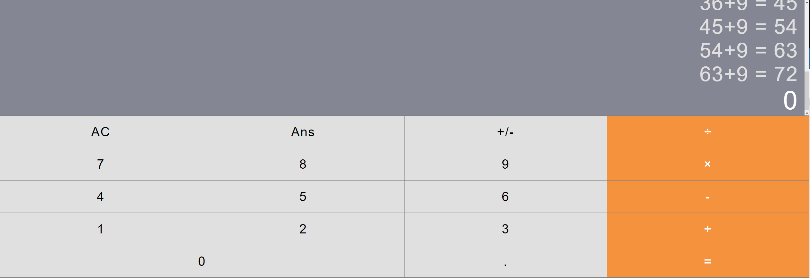

# React Calculator Completed

Используя React нужно написать кнопочный калькулятор. Должна присутствовать кнопка смены знака. При повторном нажатии на равно должна повторяться последняя операция (1+1=2 -> 2+1=3 -> 3+1=4). Должны быть обработаны неверные выражения.

В скрине "img.png" отображен внешний вид калькулятора
Реализованы такие операции, как:
сложение
вычитание
умжножение
деление
вычисление процентов
